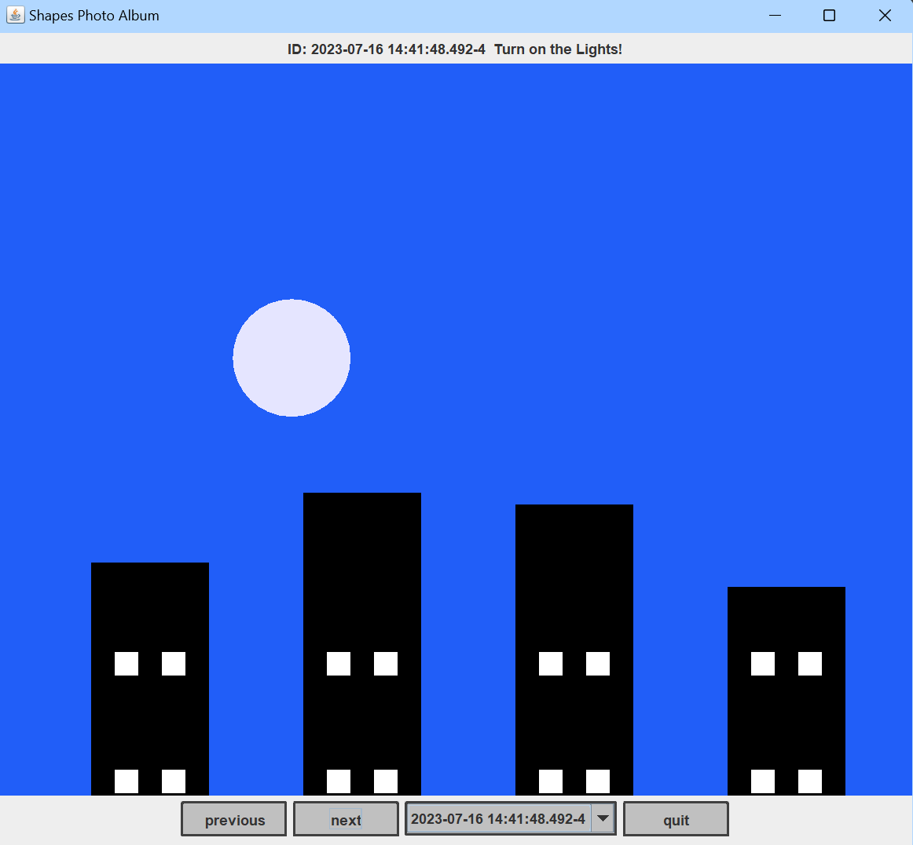

## Shapes Photo Album
A photo-album program that works as a painting canvas for drawing images with shapes, and which takes
snapshots of said “drawings”, and renders them to user in the form of a scrollable **HTML** album or **SWING** based view with 
image toggle and selecting functionality.

This project was developed with **MODEL-VIEW-CONTROLLER** design pattern and relies extensively on an 
**OBJECT-ORIENTED DESIGN** to facilitate the implementations of each program component. The program was delivered based on a rubric,
and all classes and elements of the model were tested extensively using **JUNIT**.

A more in-depth description of the program's design and implementation can be found in
[design.txt](/resources/design.txt).

### Contents
- [outputs](/outputs): Stores HTML renderings written by program
- [resources](/resources): Txt files with text instructions for controller
- [src](/src): Main source code
- [test](/test): Test code
